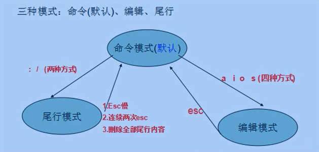

## Vim三种模式

### 1. 命令模式
###### 不管处于何种模式，只要按esc就可以进入命令模式
### 2. 编辑模式
###### 只有编辑模式下，才能将键盘输入内容输入到当前打开文件中
###### 命令模式下 i(insert)、a(append)、o(open)、c(change)、r(取代命令)、s(替换命令)都可以进入文本编辑模式
### 3. 尾行模式
###### 主要用于保存文件or退出Vim，也可设置编辑环境和一些编译工作（如：列出行号（set nu）、寻找字符串（/target））

##### Vim缓冲区
######  Vim打开文件进行编辑其实编辑的是文件在内存中的映像（即Vim缓冲区）
######  当使用Vim对缓冲区进行操作时，磁盘文件内容和内存映像不再一致，执行`w`,`x`是将缓存区内容回写到文件
| 快捷键           | 说明                                                     |
| ---------------- | -------------------------------------------------------- |
| `:ls` or `:buffers`          | 列出所有被载入到内存缓冲区的列表；`%`指明哪个缓冲区在当前窗口可见             |
| `:bnext` or `:bprev`          | 正向or反向遍历缓冲区列表      |
| `:bfirst` or `:blast`          | 跳转到vim缓冲区列表的开头和结尾      |
| `Ctrl` + `^`          | 缓冲区打开文件之间切换      |
| `:bdelete n1 n2 n3`          | 删除vim缓冲区      |

##### 命令模式下
###### 1.1 insert
| 快捷键           | 说明                                                     |
| ---------------- | -------------------------------------------------------- |
| `i`          | 光标当前位置的`前`一个字符处开始插入   i(insert)                   |
| `a`          | 光标当前位置的`后`一个字符处开始插入   a(append)           |
| `I`          | 光标当前位置的`行首`处开始插入              |
| `A`          | 光标当前位置的`行尾`处开始插入              |
| `o`          | 光标当前所在行的`下一行`开始插入              |
| `O`          | 光标当前所在行的`上一行`开始插入              |

###### 1.2 delete
| 快捷键           | 说明                                                     |
| ---------------- | -------------------------------------------------------- |
| `x`          | 删除光标`当前`位置的`一个字符`                   |
| `dd`          | 删除光标当前所在`行`          |
| `d0`          | 删除从光标所在位置到当前`行首`的内容                 |
| `d$`          | 删除从光标所在位置到当前`行尾`的内容                 |
| `cw`、`cW`          | 删除从光标所在位置到当前`单词结束`部分的内容并`进入插入模式`              |
| `cb`、`cB`          | 删除从光标所在位置到当前`单词开始`部分的内容并`进入插入模式`              |
| `dw`、`dW`          | 删除从光标所在位置到当前`单词结束`部分的内容`不进入插入模式`              |
| `db`、`dB`          | 删除从光标所在位置到当前`单词开始`部分的内容`不进入插入模式`              |
| `d)`          | 删除当前`句子`从光标位置到`句末`              |
| `d(`          | 删除当前`句子`从光标位置到`句首`              |
| `d}`          | 删除当前`段落`从光标位置到`段末`              |
| `d{`          | 删除当前`段落`从光标位置到`段首`              |
##### tips：vim命令中:
###### `0`表示行首，`$`表示行尾，`w(word)`、`b(back)`命令用于光标移动
###### `(`和`)`表示句子，`{`和`}`表示段落

###### 1.3 copy & paste
| 快捷键           | 说明                                                     |
| ---------------- | -------------------------------------------------------- |
| `y`          | 复制                   |
| `p`          | 粘贴        |
| `yw`          | 复制光标从所在位置到当前`单词结束`部分的内容                   |
| `yy`          | 复制光标当前所在`行`的所有字符（包括换行符）          |
| `p`          | 将最后一次删除or复制的文本内容粘贴到光标所在字符`后` （可多次按）               |
| `P`          | 将最后一次删除or复制的文本内容粘贴到光标所在字符`前`                |
| `yyp`          | 复制一整行到下一行          |
###### tips：vim中，`Ctrl`+`s`保存会造成屏幕假死，因为`Ctrl`+`s`默认是锁屏。 `Ctrl`+`q`解锁卡死。

###### 1.4 replace（先按键，再输入替换内容）
| 快捷键           | 介绍                                                     |
| ---------------- | -------------------------------------------------------- |
| `r`          | 替换光标当前所在字符`一次`                  |
| `R`          | 一直处于替换模式直至`esc`          |
##### tips：delete、copy操作可加操作次数 例：d3w、10dd

###### 1.5 撤销、反撤销
| 快捷键           | 介绍                                                     |
| ---------------- | -------------------------------------------------------- |
| `u`          | 撤销最近的一次操作                 |
| `Ctrl`+ `r`          | 恢复最近一次操作（取消撤销）         |
##### tips：可多次执行`u`

###### 1.6 光标移动（←h    j↓    k↑    l→）
|  `行级移动`           | 说明                                                     |
| ---------------- | -------------------------------------------------------- |
| `0`      | 移动光标到`行首`                |
| `$`      | 移动光标到`行尾`                |
| `^`      | 移动光标到当前行 第一个`非空`字符                |
| `nG` or `:n`     | 移动光标到当前文件的第n行               |

|  `文件首尾移动`           | 说明                                                     |
| ---------------- | -------------------------------------------------------- |
| `gg` or `:0`     | 移动光标到文件`第一行`                |
| `GG` or `:$`      | 移动光标到文件`末尾行`                |

|  `单词级移动`           | 说明                                                     |
| ---------------- | -------------------------------------------------------- |
| `w` or `W`     | 移动光标到下一个单词开头                |
| `b` or `B`      | 移动光标到上一个单词开头                |
| `e` or `E`      | 移动光标到所在单词末尾                |
| `*`      | 移动光标到所在单词的下一个单词                |
| `#`      | 移动光标到所在单词的上一个单词                |
| `e` or `E`      | 移动光标到所在单词末尾                |

|  `符号级移动`           | 说明                                                     |
| ---------------- | -------------------------------------------------------- |
| `%`     | 移动光标到`括号`左半部分（包括(、{、[ )对应右半匹配部分( )、}、] ）               |
| `{` or `}`      | 移动光标到`段落`开头或末尾                |

|  `屏幕及翻页级移动`           | 说明                                                     |
| ---------------- | -------------------------------------------------------- |
| `H`     | 移动光标到`屏幕`第一行               |
| `M`     | 移动光标到`屏幕`中间一行               |
| `L`     | 移动光标到`屏幕`最后一行               |
| `Ctrl` + `f`      | 向前滚动一页                |
| `Ctrl` + `b`      | 向后滚动一页                |
| `Ctrl` + `u`      | 向前滚动半页                |
| `Ctrl` + `d`      | 向后滚动半页                |

###### tips：vim命令组合
###### <start_position><command><end_position> 如：0y$

#### vim使用ctags实现函数跳转
|  命令           | 说明                                                     |
| ---------------- | -------------------------------------------------------- |
| `:ctags -R`     | 生成当前项目所有源文件对应的tag标签文件              |
| `Ctrl` + `]`     | 光标移到某个标识上、可跳转到对应的定义位置               |
| `Ctrl` + `T`     | 跳转到前一次的tag处               |
| `Ctrl` + `O`     | 回退到原来地方               |
| `:split`     | 分割窗口               |
| `gd`     | 若当前光标下是局部变量，`gd`可跳转到该局部变量定义处               |

###### 1.7. 选择模式

|  `字符选择模式`           | 说明                                                     |
| ---------------- | -------------------------------------------------------- |
| `v`     | 选中光标经过的所有字符              |

|  `行选择模式`           | 说明                                                     |
| ---------------- | -------------------------------------------------------- |
| `V`     | 选中光标经过的所有行            |

|  `块选择模式`           | 说明                                                     |
| ---------------- | -------------------------------------------------------- |
| `Ctrl` +  `v`  | 选中一整个举行框表示的所有文本。 同时编辑多行时，只有当前的插入动作结束后按`Esc`,之前选中的奇特航才会出现同样的插入文本             |

|  `多行注释`           | 说明                                                     |
| ---------------- | -------------------------------------------------------- |
| 1. `Ctrl` +  `v`  | 选中多行             |
| 2. `I`  | 光标到起始位置，进入行首插入模式，插入注释符            |
| 3. `Esc`  | 回到命令模式            |

###### 1.8 搜索模式
|  `搜索模式`           | 说明                                                     |
| ---------------- | -------------------------------------------------------- |
| `/`  | 正向往下搜索 (`\c`强制搜索不区分大小写 `/C`强制搜索区分大小写)            |
| `?`  | 反向往上搜索             |
| `*`  | 若当前光标选中 var，`*`相当于/\<var\>；效果则是`跳转`到选中单词的`下一个`查找结果           |
| `#`  | 若当前光标选中 var，`*`相当于?\<var\>；效果则是`跳转`到选中单词的`上一个`查找结果                   |
| `n`  | 搜索模式下继续`正向`查找下一个匹配字符串             |
| `N`  | 反向匹配字符串             |
| `:set hlsearch`  | 高亮显示           |
| `:nohlsearch` or `:noh` | 清除高亮显示           |
| `:set ignorecase`  | 不区分大小写（vim默认大小写敏感）             |
| `:set smartcase`  | 若输入中有大写字母，vim认为需区分大小写，若输入中无大写字母，vim认为不区分大小写             |

|  `搜索光标当前所在位置单词`           | 说明                                                     |
| ---------------- | -------------------------------------------------------- |
| 1. `/`  | 进入搜索模式            |
| 2. `Ctrl`+`r`&`Ctrl`+`w`or`Ctrl`+`a`     | 复制光标下单词并插入命令行                |
| 3. `Ctrl`+`o`    | 光标跳转到开始搜索的位置               |
| 4. `Ctrl`+`i`    | 往前跳转               |

|  `正则表达式搜索`           | 说明                                                     |
| ---------------- | -------------------------------------------------------- |
|  `^`  | 一行的开头            |
|  `$`  | 一行的结尾                |
|  `.`  | 表示任意一个字符              |
|  `*`  | 匹配0次or n次               |

###### tips: `\<`是一个单词定界符，只匹配单词开头；`\>`只匹配单词末尾
###### 搜索特殊字符需加转义符号`\`，如`*`、`[`、`]`、`^`、`%`、`/`、`?`、`~`、`$`

###### 1.9 自动补全
|  `单词补全`           | 说明                                                     |
| ---------------- | -------------------------------------------------------- |
| `Ctrl` + `n`  | 输入第一个字母后，再按`Ctrl`+`n`,Vim会自动出现下拉列表，默认选中第一个          |
| `Ctrl` + `p`  | 输入第一个字母后，再按`Ctrl`+`p`,Vim会自动出现下拉列表，默认选中最后一个          |

#### 尾行模式下

###### 3.1 打开文件
|  `打开文件`           | 说明                                                     |
| ---------------- | -------------------------------------------------------- |
| `:edit {file}` or  `:e`  | 选中多行             |
###### tips: Vim命令行中，`%`会展开形成当前文件的完整路径

###### 3.1 保存
| 快捷键           | 说明                                                     |
| ---------------- | -------------------------------------------------------- |
| `:w` or `:write`         | 保存当前编辑的文件                |
| `:wq`         | 保存当前编辑的文件并退出vim         |
| `:w!`          | 强制保存当前编辑的文件                |

###### 3.2 另存为
| 快捷键           | 说明                                                     |
| ---------------- | -------------------------------------------------------- |
| `:w xxx.txt`          | 将vim当前打开文件另存为新文件xxx.txt                |

###### 3.3 替换命令
| 快捷键           | 说明                                                     |
| ---------------- | -------------------------------------------------------- |
|`:[range]s/源字符串/目标字符串/[option]`   | 替换命令                |

| `参数说明`        | 说明                                                     |
| ---------------- | -------------------------------------------------------- |
| `range`   | 表示搜索范围，默认表示当前行；`1,10`:第1行到第10行；`%`:整个文件；`.,$`:当前行到末尾                |
| `s`   | `substitude`简写，表替换               |
| `option`   | 表示操作类型，默认只对第一个匹配的字符进行替换；`i`(ignorecase):不区分大小写；`g`(global):全局替换；`c`(comfirm):操作时要确认    |
